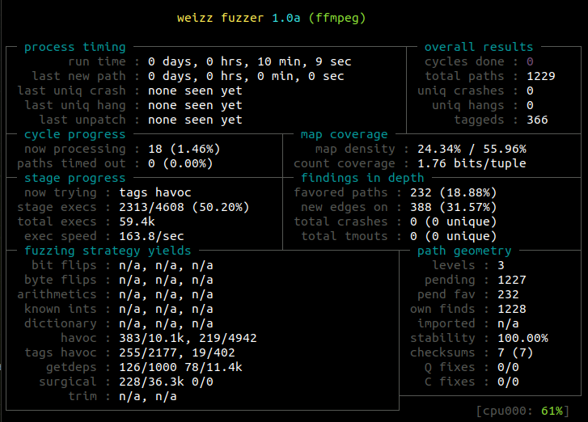

```
  _      __    _          ____                   
 | | /| / /__ (_)_____   / __/_ ________ ___ ____
 | |/ |/ / -_) /_ /_ /  / _// // /_ /_ // -_) __/
 |__/|__/\__/_//__/__/ /_/  \_,_//__/__/\__/_/   
                                               v1.0

  Written and maintained by Andrea Fioraldi <andreafioraldi@gmail.com>
  Based on American Fuzzy Lop by Michal Zalewski

```

## Prepare and Build

Download Weizz with:

```
$ git clone https://github.com/andreafioraldi/weizz
```

Build the fuzzer, the QEMU and the LLVM tracers with:

```
$ make
```

## Usage

The command line usage of Weizz is similar to AFL.

```
$ ./prepare_sys.sh # needed only one time each boot
$ ./weizz -i seeds_dir -o findings_dir [ options ] -- ./program [ args... ]
```

Use `weizz --help` to show the all commands.

Note that the llvm-tracer is experimental and lacks of the checksums pacthing
and context-sensitive coverage.

## Example

Download the lastest snapshot of the FFmpeg source.

```
$ wget https://ffmpeg.org/releases/ffmpeg-snapshot.tar.bz2
$ tar xvf ffmpeg-snapshot.tar.bz2
```

Build it without instrumentation:

```
$ cd ffmpeg
$ ./configure
$ make
```

Fuzz FFmpeg with Weizz in QEMU mode enabling the structural mutations (-w -h)
and a limit of 8k for each testcase to enter in getdeps:

```
$ mkdir INPUTS
$ cp /path/to/weizz/testcases/5.7kb.avi INPUTS/
$ WEIZZ_CTX_SENSITIVE=1 /path/to/weizz/weizz -i INPUTS -o OUTPUT \
  -d -w -h -Q -L 8k -- ./ffmpeg -y -i @@ -c:v mpeg4 -c:a out.mp4
```



## Cite

Preprint: https://andreafioraldi.github.io/assets/weizz-issta2020.pdf

Presentation video: https://www.youtube.com/watch?v=67Bj1AaEECE

```
@inproceedings{weizz-ISSTA20,
    author = {Fioraldi, Andrea and D'Elia, Daniele Cono and Coppa, Emilio },
    title = {{WEIZZ}: Automatic Grey-box Fuzzing for Structured Binary Formats},
    year = {2020},
    isbn = {9781450380089},
    publisher = {Association for Computing Machinery},
    address = {New York, NY, USA},
    url = {https://doi.org/10.1145/3395363.3397372},
    doi = {10.1145/3395363.3397372},
    booktitle = {Proceedings of the 29th ACM SIGSOFT International Symposium on Software Testing and Analysis},
    series = {ISSTA 2020}
}
```

